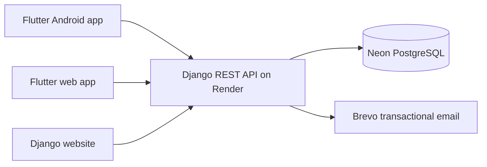

<div align="center">
  
  <h1>Rokto Dorkar</h1>
  <p><strong>A verified blood donor network built for Bangladesh.</strong></p>
  <p>
    <a href="https://github.com/ahsanulanam67/Rokto-Dorkar/releases/download/v1.0.0/Rokto-Dorkar-v1.0.apk"></a>
    <a href="https://rokto-dorkar.onrender.com/api/v1/health/"></a>
  </p>
  <p>
    
    
    
    
  </p>
</div>

Rokto Dorkar connects patients and verified blood donors across Bangladesh. The project combines a Flutter mobile/web client, a Django REST API, role-based moderation, Brevo email OTP authentication, and a Neon PostgreSQL database.

> The Render service uses a free instance and may take up to a minute to wake after inactivity.

## Project outcome

| Deliverable | Status | Location |
| --- | --- | --- |
| Android application | v1.0.0 installable APK | [Download APK](https://github.com/ahsanulanam67/Rokto-Dorkar/releases/download/v1.0.0/Rokto-Dorkar-v1.0.apk) |
| Flutter application | Android, iOS, and web source | [`flutter_app/`](flutter_app/) |
| REST API | Deployed on Render | [API health check](https://rokto-dorkar.onrender.com/api/v1/health/) |
| Database | Neon serverless PostgreSQL | Configured through `DATABASE_URL` |
| Web deployment | Vercel-ready Flutter web build | [`flutter_app/vercel.json`](flutter_app/vercel.json) |
| Original website | Server-rendered Django interface | [`Blood_app/templates/`](Blood_app/templates/) |

The checked-in APK is intended for direct installation and evaluation. It is signed with the Android development key; publish an AAB signed with a private release key before distributing through Google Play.

## What it does

### Donors and requests

- Browse and search eligible donors by blood group, division, district, and upazila.
- View blood group, phone number, availability, last donation, and eligibility.
- Open the phone dialer directly from a compact donor card.
- Show gender-based avatars without storing profile photos.
- Create urgent blood requests and let owners mark them fulfilled.
- Keep donor and request data fresh from the API while loading the Bangladesh location catalog locally for speed.

### Accounts and security

- Register using email, mandatory phone number, name, blood group, gender, and location.
- Verify new accounts with a six-digit Brevo email OTP.
- Reset forgotten passwords through a separate expiring email OTP flow.
- Store JWT credentials in platform secure storage and rotate refresh tokens.
- Revoke existing sessions after a password reset.
- Apply login and OTP throttling, expiry windows, and maximum-attempt limits.

### Administration

- Support `user`, `moderator`, and `admin` roles with API-enforced permissions.
- Let moderators and admins create donor records for people without accounts.
- Let admins promote users to moderator or admin.
- Let admins delete user accounts and donor records.
- Detect phone-number matches when a manually entered donor later registers.
- Let admins resolve a duplicate by removing the manual record or dismissing the alert.

### Bangladesh coverage

- 8 divisions, 64 districts, and 500 upazilas using current English names.
- Cascading location selection in registration, profiles, donor management, and search.
- Legacy location normalization through a Django data migration.
- Coordinate/radius filtering is supported by the API and reserved for a future map experience.

See [location-data.md](docs/location-data.md) for the data sources and naming decisions.

## Architecture



| Layer | Technology | Responsibility |
| --- | --- | --- |
| Client | Flutter, Provider, Dio | Responsive UI, secure sessions, API integration |
| API | Django REST Framework, Simple JWT | Validation, permissions, donor/request workflows |
| Database | Neon PostgreSQL | Users, donors, requests, OTPs, duplicate alerts |
| Email | Brevo transactional API | Registration and password-reset OTP delivery |
| Hosting | Render and Vercel | Django API and Flutter web deployment |

## Role permissions

| Capability | User | Moderator | Admin |
| --- | :---: | :---: | :---: |
| Maintain own donor profile | ✓ | ✓ | ✓ |
| Search donors and create requests | ✓ | ✓ | ✓ |
| Add a donor without an account |  | ✓ | ✓ |
| Manage donor availability |  | ✓ | ✓ |
| Review duplicate donor alerts |  |  | ✓ |
| Promote or demote staff roles |  |  | ✓ |
| Delete users and donor records |  |  | ✓ |

## Repository layout

```text
Accounts/          Email-first user model, roles, OTPs, admin bootstrap
Blood/             Django settings, security configuration, root URLs
Blood_app/         Donors, blood requests, duplicate detection, REST API, website
docs/              Location data notes and sources
flutter_app/       Flutter application for Android, iOS, and web
releases/          Installable Android outcome
render.yaml        Render Blueprint configuration
```

## Quick start

### 1. Backend

Python 3.12 is recommended.

```bash
git clone git@github.com:ahsanulanam67/Rokto-Dorkar.git
cd Rokto-Dorkar

python3 -m venv .venv
source .venv/bin/activate
pip install -r requirements.txt
cp .env.example .env
python manage.py migrate
python manage.py runserver
```

The local API health check is `http://127.0.0.1:8000/api/v1/health/`.

### 2. Flutter app

```bash
cd flutter_app
flutter pub get
flutter run -d chrome
```

The Flutter app uses the deployed Render API by default. Override it for local development:

```bash
# Chrome or iOS simulator
flutter run --dart-define=API_BASE_URL=http://127.0.0.1:8000/api/v1/

# Android emulator
flutter run --dart-define=API_BASE_URL=http://10.0.2.2:8000/api/v1/
```

## Environment variables

Start from [`.env.example`](.env.example). Never commit real secrets.

| Variable | Purpose |
| --- | --- |
| `SECRET_KEY` | Django cryptographic secret |
| `DATABASE_URL` | Neon pooled PostgreSQL connection string |
| `DATABASE_SSL` | Require PostgreSQL SSL in production |
| `ALLOWED_HOSTS` | Accepted Django host names |
| `CORS_ALLOWED_ORIGINS` | Allowed Flutter web origins |
| `CSRF_TRUSTED_ORIGINS` | Trusted HTTPS origins |
| `BREVO_API_KEY` | Brevo transactional-email credential |
| `BREVO_SENDER_EMAIL` | Brevo-verified sender address |
| `BREVO_SENDER_NAME` | Sender display name; normally `Rokto Dorkar` |
| `OTP_EXPIRY_MINUTES` | OTP lifetime |
| `OTP_RESEND_SECONDS` | Minimum resend interval |
| `OTP_MAX_ATTEMPTS` | Maximum verification attempts |

## Main API routes

All routes are under `/api/v1/`.

| Method | Route | Purpose |
| --- | --- | --- |
| `GET` | `health/` | Deployment health check |
| `POST` | `auth/register/` | Request registration OTP |
| `POST` | `auth/register/verify/` | Verify registration and issue JWTs |
| `POST` | `auth/login/` | Email/password login |
| `POST` | `auth/password-reset/request/` | Request password-reset OTP |
| `POST` | `auth/password-reset/confirm/` | Verify OTP and set a new password |
| `GET/PATCH` | `profile/` | Read or update the authenticated profile |
| `GET` | `donors/` | Search available and eligible donors |
| `GET/POST` | `requests/` | Browse or create blood requests |
| `POST` | `moderation/donors/` | Add a donor without an account |
| `GET/PATCH/DELETE` | `admin/...` | Roles, duplicate review, user/donor deletion |

## Deployment

### Render + Neon

1. Create a Neon project in the Singapore region and copy its pooled connection string.
2. Create a Render Blueprint using [`render.yaml`](render.yaml).
3. Add the secret environment variables from [`.env.example`](.env.example).
4. Use `?sslmode=require` in the Neon connection string.
5. Verify the configured Brevo sender before enabling production OTP delivery.

The Blueprint installs dependencies, collects static files, applies migrations, ensures the configured superuser, and starts Gunicorn.

### Vercel

1. Import this repository into Vercel.
2. Set the Root Directory to `flutter_app`.
3. Add `API_BASE_URL=https://rokto-dorkar.onrender.com/api/v1/`.
4. Deploy. The included Vercel configuration handles Flutter web and SPA routing.

### Android release

```bash
cd flutter_app
flutter analyze
flutter test
flutter build apk --release --build-name=1.0.0 --build-number=1
```

For Google Play, configure a private upload key and build an app bundle:

```bash
flutter build appbundle --release
```

## Verification

```bash
# Backend
python manage.py test

# Flutter
cd flutter_app
flutter analyze
flutter test
```

The v1.0.0 APK was built with a clean Flutter analysis and all Flutter tests passing.

## Privacy and data behavior

- Profile photos and precise user locations are not collected by the Flutter app.
- Access and refresh tokens are kept in platform secure storage.
- Donors, requests, and profiles are fetched from the API rather than persisted as an offline cache.
- Only the non-sensitive Bangladesh location catalog is bundled and cached in memory.
- Server-side permissions remain authoritative; hiding an action in the UI is never treated as access control.

---

<div align="center">
  Developed by <strong>GDevs Bd</strong>
</div>
